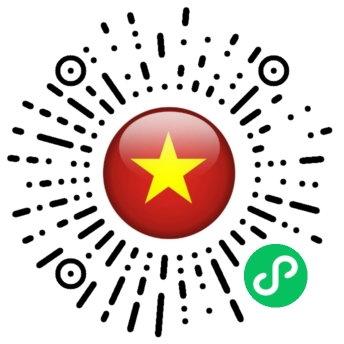

# YueTranslate (悦翻译)

[简体中文](README.md) | **English** | [Tiếng Việt](README.vi.md)

> Chinese–Vietnamese simultaneous interpretation WeChat Mini Program + real-time translation backend
>
> A free public-service translation tool for China–Vietnam cross-border scenarios: real-time simultaneous interpretation while you speak, face-to-face dual-mic conversation, photo translation, text translation, plus a free translator/business matching directory.

## 📲 Scan to try



Open WeChat, scan the QR code above, and try the YueTranslate Mini Program.

## ✨ Features

### Translation capabilities (Mini Program "Interpret" page, 4 inline modes)

| Mode | Description | Pricing |
|------|-------------|---------|
| 🎙️ **Simultaneous** | Real-time interpretation: translation appears as you speak, over a streaming WebSocket pipeline | 30 free minutes per day; voice packs available beyond that |
| 🗣️ **Face-to-Face** | Dual-mic, one sentence at a time: each person holds their own mic to talk (PTT); the other side sees the translation upside-down — ideal for in-person conversations | Same as above (reuses the interpretation pipeline) |
| 📷 **Photo Translation** | Take/choose a photo, recognize and translate the text in it (vision LLM) | Free (rate-limited only) |
| ✍️ **Text Translation** | Instant translation of typed text | Free (rate-limited only) |

### Public-service directory (free)

- 🔍 **Find a Translator**: translators/agencies join for free; filter by 59 languages, interpretation/translation services, and 20 professional domains (multi-select)
- 💼 **Find Business**: post translation needs; auto-matched to suitable translators by language ∩ service ∩ domain
- 📚 **Common Phrases**: Chinese–Vietnamese phrasebook with audio playback, covering travel, lodging, trade, and other high-frequency scenarios

### Product principles

- No phone number collection, no commission on translation fees; translator listing is free forever
- Only simultaneous interpretation beyond the daily free quota is billed (voice packs ¥9.9 / ¥19.9 / ¥49.9 for 60 / 200 / 600 minutes, one-time purchase, never expires)

## 🛠️ Tech Stack

| Layer | Technology |
|-------|------------|
| Mini Program frontend | Native WeChat Mini Program (WXML / WXSS / JS), 5-tab layout |
| Backend framework | Python 3.13 + FastAPI + Uvicorn |
| Real-time interpretation | WebSocket proxy → Alibaba Cloud DashScope `qwen3.5-livetranslate-flash-realtime` |
| Photo translation | `qwen-vl-plus` (vision) |
| Text translation | `qwen-plus` |
| Database | PostgreSQL (production) / SQLite (local dev), SQLAlchemy 2.0 |
| Cache / rate limiting | Redis (production) / fakeredis (local dev) |
| Auth | WeChat openid login + JWT; admin console with CAPTCHA |
| Payments | WeChat virtual payment (voice packs) |
| Deployment | Docker Compose (app + postgres + redis) |

## 📁 Project Structure

```
vi-translate/
├── miniprogram/                  # WeChat Mini Program frontend (open this dir in DevTools)
│   ├── app.{js,json,wxss}        # Global config (5 tabs: Interpret / Translators / Business / Phrases / Me)
│   ├── pages/
│   │   ├── index/                # Main page (Simultaneous / Face-to-Face / Photo / Text, inline modes)
│   │   ├── services/             # Find a Translator (directory + filters)
│   │   ├── translator-detail/    #   └─ Translator details
│   │   ├── translator-edit/      #   └─ Translator onboarding / profile editing
│   │   ├── business-publish/     # Find Business (post a translation need)
│   │   ├── matched-needs/        #   └─ Needs matched to me
│   │   ├── my-needs/             #   └─ Needs I posted
│   │   ├── ask/                  # Common Phrases (categorized phrases + audio)
│   │   ├── profile/              # Me (user ID / quota / settings)
│   │   ├── pricing/ pay/         # Voice pack purchase
│   │   ├── history/              # Translation history
│   │   └── face/                 # Standalone Face-to-Face page (backup; main entry is inlined in index)
│   ├── utils/
│   │   ├── live.js               # Interpretation WebSocket client (connect/finish/stop)
│   │   ├── recorder.js           # PCM recording
│   │   └── ...
│   └── components/               # Shared components
│
├── live-translate/               # Backend service (FastAPI)
│   ├── app/
│   │   ├── main.py               # Application entry
│   │   ├── config.py             # Config (free quota / rate limits, etc.)
│   │   ├── models.py             # SQLAlchemy models
│   │   ├── translate/proxy.py    # Real-time interpretation WebSocket proxy (core)
│   │   ├── photo/                # Photo translation + text translation APIs
│   │   ├── directory/            # Translator/business directory (authoritative language/domain catalog in catalog.py)
│   │   ├── auth/                 # WeChat login / JWT / SMS
│   │   ├── billing/              # Quotas and voice pack plans
│   │   ├── payments/             # WeChat virtual payment
│   │   ├── admin/                # Admin APIs
│   │   └── sessions/ security/   # Sessions and security
│   ├── migrations/               # SQL migration scripts
│   ├── static/                   # Admin console / phrase audio and other static assets
│   ├── tests/                    # pytest test suite
│   ├── deploy/                   # Docker Compose deployment scripts
│   ├── requirements.txt
│   ├── run.ps1                   # One-click local start on Windows
│   └── .env.example              # Environment variable template
│
└── README.md
```

## 🚀 Getting Started

### 1. Backend (local development)

Local mode uses SQLite + fakeredis — no Docker / PostgreSQL / Redis required.

```bash
cd live-translate

# 1. Create a virtual environment (Python 3.13)
python -m venv .venv
# Windows:
.venv\Scripts\activate
# Linux/macOS:
source .venv/bin/activate

# 2. Install dependencies
pip install -r requirements.txt

# 3. Configure environment variables
cp .env.example .env
# Edit .env and at minimum set DASHSCOPE_API_KEY (apply at https://dashscope.console.aliyun.com/apiKey)

# 4. Start
uvicorn app.main:app --host 0.0.0.0 --port 8000
# On Windows you can also run: .\run.ps1
```

Once started, `http://127.0.0.1:8000/healthz` should return ok.

### 2. Backend (production deployment)

```bash
cd live-translate/deploy
cp ../.env.example .env   # Fill in production config (setup.sh auto-generates strong random passwords/keys)
./setup.sh                # First deployment: brings up app + postgres + redis
./update.sh               # Subsequent updates: rebuild and restart
```

### 3. Mini Program frontend

1. Open **WeChat DevTools**, import the project, and choose the `miniprogram/` directory
2. Enter your own Mini Program AppID (or use a "test account")
3. Change the backend address under `miniprogram/utils/` to your deployed domain (production requires configuring request/socket whitelisted domains in the WeChat Official Platform, HTTPS/WSS only)
4. Compile and run in the simulator; scan the QR code for real-device preview

### Key environment variables

| Variable | Description |
|----------|-------------|
| `DASHSCOPE_API_KEY` | Alibaba Cloud DashScope API key (required; shared by interpretation/photo/text translation) |
| `TRANSLATE_MODEL` | Interpretation model, default `qwen3.5-livetranslate-flash-realtime` |
| `DATABASE_URL` | PostgreSQL connection string (optional locally; falls back to SQLite) |
| `REDIS_URL` | Redis connection string (optional locally; falls back to fakeredis) |
| `JWT_SECRET` | JWT signing secret (must be strong random in production) |
| `DIRECTORY_CONTACT_KEY` | Fernet key for encrypting translator contact info |
| `FREE_DAILY_MINUTES` | Daily free interpretation minutes, default 30 |

See [`live-translate/.env.example`](live-translate/.env.example) for the full list.

## 🧪 Tests

```bash
cd live-translate
pytest tests/
```

## 📄 License

Copyright © Yuexun Translation. Source code is public for learning and reference; contact the author for commercial use.

---

*YueTranslate — removing the language barrier between China and Vietnam.*
